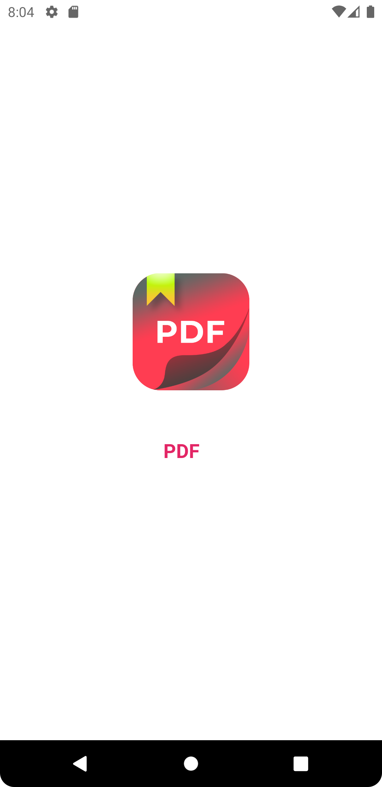
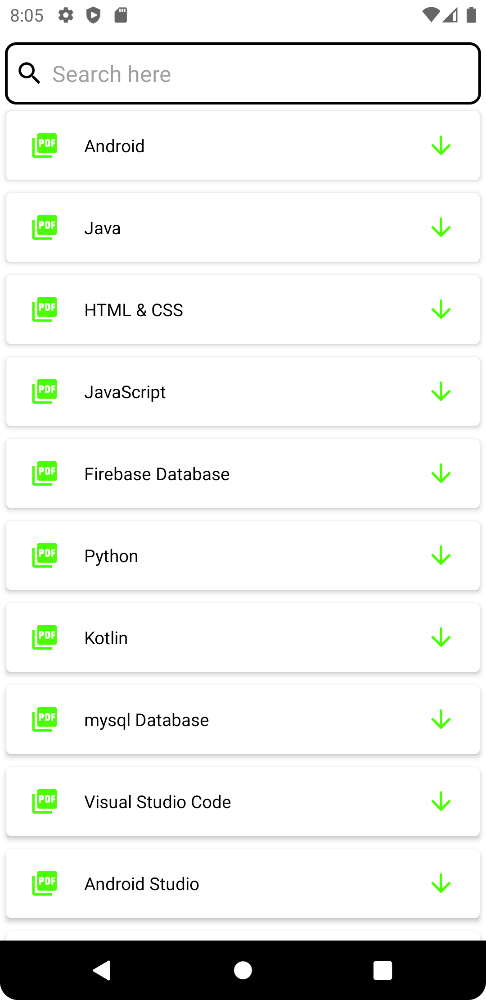
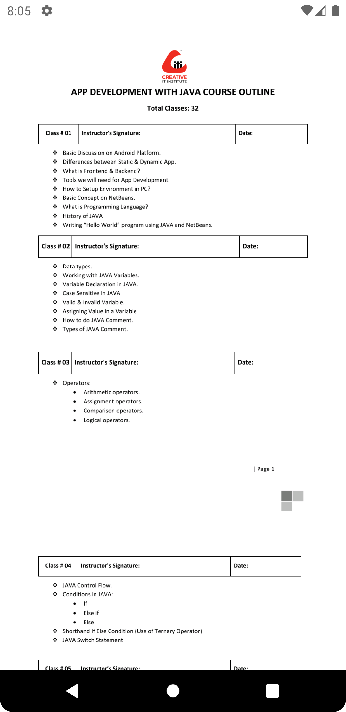

## General

This eBook App is Created in android studio using java Firebase & Admob

<a id="raw-url" href="apk/PDF.apk?raw=true">
</a>

## Screenshots

|                                       Splash Screen                 |                            All Ebook                           |                            PDFView                          |
| :------------------------------------------------------------------: | :-----------------------------------------------------------------: | :------------------------------------------------------------------: |
|   |  |   |

## Dependencies

```
implementation 'com.google.firebase:firebase-database:20.0.3'
implementation 'com.google.firebase:firebase-storage:20.0.0'
implementation 'com.facebook.shimmer:shimmer:0.5.0'
implementation 'com.github.kk121:File-Loader:1.2'
implementation 'com.github.barteksc:android-pdf-viewer:2.8.2'
implementation 'com.google.android.gms:play-services-ads:20.5.0'
```
